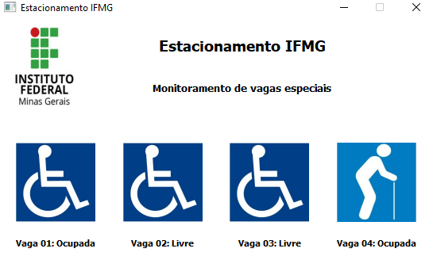

# mqtt-estacionamento

Controle de vagas especiais em um estacionamento utilizando QtDesigner, python e o protocolo MQTT.

## PyQt5, paho-mqtt

PyQt5 é uma biblioteca para criação de interfaces gráficas de maneira rápida e agradável.

paho-mqtt é uma biblioteca que possibilita a comunicação com broker MQTT para envio e recebimento de mensagens.

## Instalação de bibliotecas
Use o gerenciador de pacotes [pip](https://pip.pypa.io/en/stable/) para instalar as bibliotecas necessárias.

```bash
pip install PyQt5
pip install paho-mqtt
```

## Broker utilizado

As mensagens são enviadas ao broker gratuito do seguinte link: [free mqtt broker](https://www.hivemq.com/public-mqtt-broker/)

## Execução do programa de envio das mensagens

Rode o arquivo mqtt-publisher.py para iniciar o envio das mensagens ao broker.

**Resultado esperado:** Mensagem : {"Vaga01":"Ocupada","Vaga02":"Livre","Vaga03":"Livre","Vaga04":"Ocupada"} enviada para o topico esp/vagas

## Execução do programa de monitoramento das vagas

Rode o arquivo main.py para carregar a tela de monitoramento, note que a mensagem enviada ao broker é captada pelo script e traduzida para cada vaga da tela abaixo:




